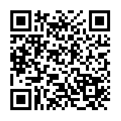

# bch-message-web3-spa

This is a web-based single page app (SPA) written in React. It is forked from [bch-wallet-web3-spa](https://github.com/Permissionless-Software-Foundation/bch-wallet-web3-spa), which provides non-custodial wallet features for the Bitcoin Cash blockchain, including support for SLP tokens and NFTs.

This fork has been customized to provide a simple interface for sending and receiving end-to-end encrypted (**E2EE**) messages on the Bitcoin Cash blockchain. It operates very similar to web-based email. But encrypted messages are stored on a [Nostr](https://nostr.com/) relay, the messages are encrypted with the private key of a BCH wallet, and an alert signal is sent to the recipients BCH address using a 'dust' transaction.

## Installation
```bash
git clone https://github.com/Permissionless-Software-Foundation/bch-message-web3-spa
cd bch-message-web3-spa
npm install
npm start
npm run build
```

## Support

Have questions? Need help? Join our community support
[Telegram channel](https://t.me/bch_js_toolkit)

## Donate

This open source software is developed and maintained by the [Permissionless Software Foundation](https://psfoundation.cash). If this library provides value to you, please consider making a donation to support the PSF developers:

<div align="center">

<p>bitcoincash:qqsrke9lh257tqen99dkyy2emh4uty0vky9y0z0lsr</p>
</div>

## License
[MIT](./LICENSE.md)
